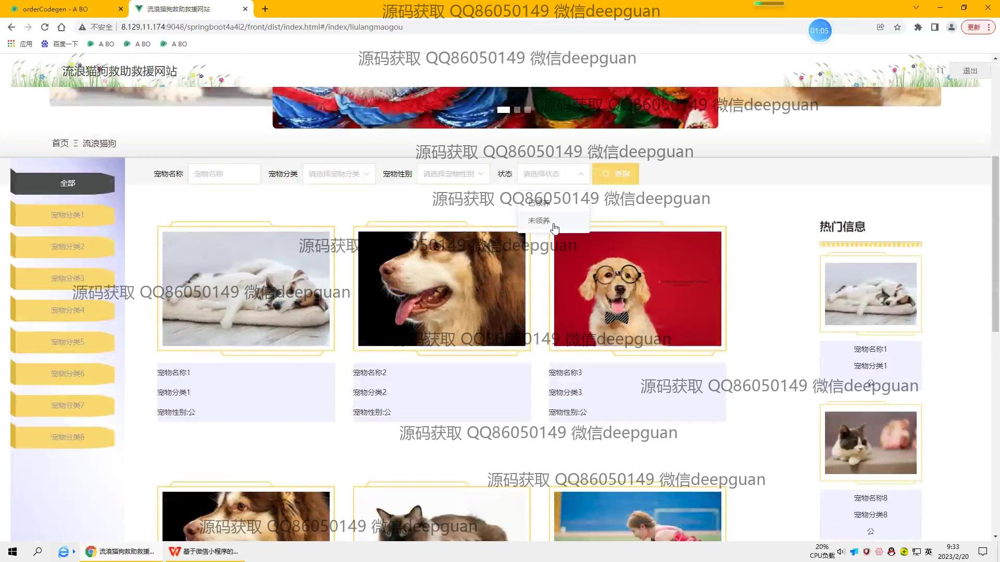
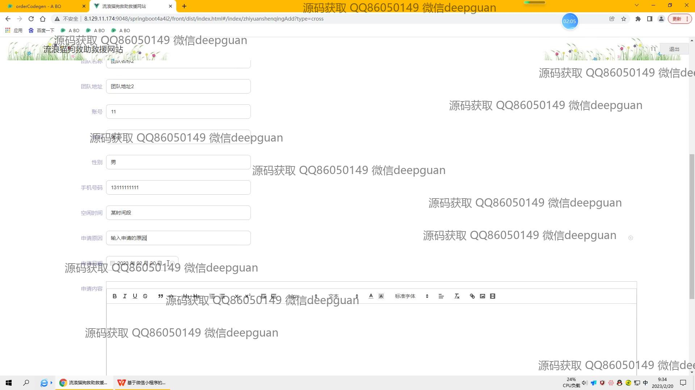

<h1 align="center">流浪猫狗救助救援网站</h1>

## 简介
流浪猫狗救助救援网站：角色分为管理员、用户；主要功能包括动物信息管理、志愿者申请审核、知识内容发布、领养信息管理、团队活动组织、救助知识普及和用户互动交流。    --计算机毕业设计源码；毕设源码；java毕业设计源码

## 联系方式

<h3 align="center">获取完整代码与数据库文件 + 微信：deepguan QQ: 86050149 QQ群: 783742310</h3>

<h3 align="center">可帮忙远程部署 包运行成功！提供远程部署、修改代码、设计文档指导、代码讲解等服务！</h3>

## 功能介绍（完整见运行截图）
管理员：登录，注册及管理后台访问，负责流浪动物信息发布、领养和救助信息管理，志愿者和团队申请审核，活动及知识类型管理，以及网站内容编辑包括系统首页和“关于我们”部分的维护。通过系统导航栏操作模块，如用户管理、宠物管理、活动管理等，实现信息录入、审核状态更新和救助信息的及时调整，确保网站正常运行和内容更新。

用户：用户可以在网站上注册并登录以浏览流浪动物信息和参与救援活动。用户可查看和申请领养流浪猫狗，查询救助信息，访问“关于我们”页面了解救助组织情况，或通过公开的捐助渠道和救援联系方式参与救助工作。用户可通过评论和互动功能表达意见并参与社区交流。

志愿者：志愿者可以通过填写线上表单提交申请，提供个人信息、空闲时间、申请原因等内容。通过导航栏和个人中心，志愿者可以查看已提交的信息或等待申请确认。认证后的志愿者可参与救助和领养活动，帮助流浪动物管理和现场救援。

团队：团队管理包括信息录入和管理模块，支持团队名称、地址、成员人数及活动数据的输入和管理。可以上传团队活动图片，详细描述救援行动，以便于组织大规模救援活动并与公众分享实践经验。通过后台申请，团队可认可新的志愿者并规划集体行动。

## 运行截图

本代码来源于网络,仅供学习参考使用!

